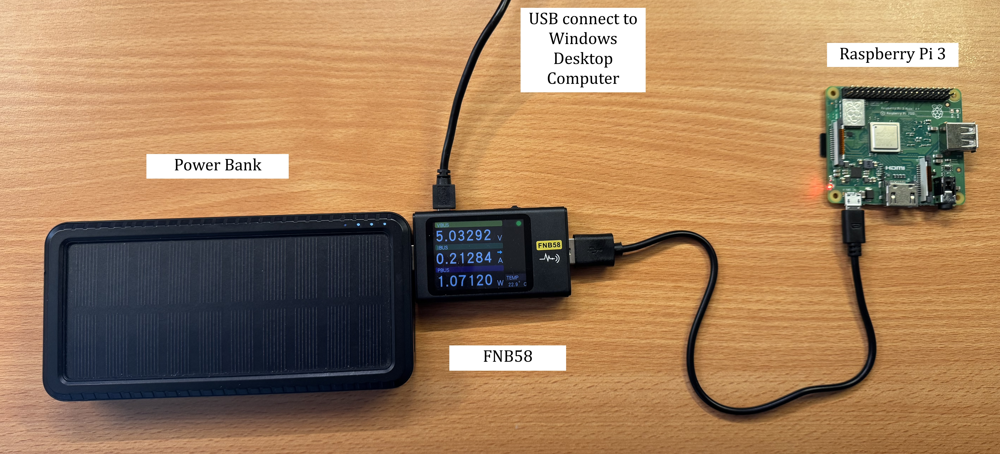
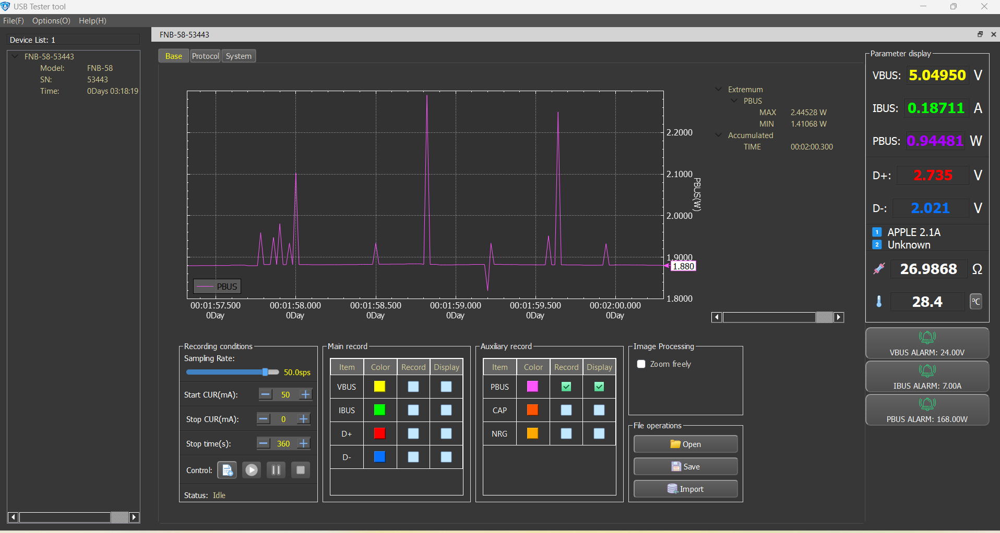

# Comparing performance and viability of PQC on different architectures

OpenSSL now has integrated PQC. This offers us a superb opportunity to try and compare the performance and power needs of PQC algorithms vs traditional ones on different architectures, such as IoT devices (Pi zero 32bits/64bits, Pi 4 8gb), x86 architecture (AMD/Intel) and Mac ARM M1 architecture.

The methods that are tested are Key Generation and Signatures (Signing).

To test it on your own, you need to download the repo to a Unix machine, with OpenSSL 3.5+ installed (see below)  
All my power reading data is available here, or if you'd like to try for yourself, get your hands on a FNB58 and follow instructions given in the Power Readings section. It does include data for TLS Handshake and Verifying, however, the data collected is not useful (TLS Handshake were not processed properly, and Verifying is consistent over every algorithm, therefore not very useful.However, all the data is available within Power Readings / full_results.csv)
All keys, certs and signatures are replaced automatically, so the files available here are just the last ones created on this machine by running the benchmark programs.

Then simply run

```bash
python3 pqc_benchmark.py
# or, if you just want an overview
# (but if you choose many iterations on a slow machine, be very patient!)
python3 pqc_benchmark_automated.py
```

(Windows integration is possible, you just need to modify the code to match the windows Openssl PATH)

- Then launch the program with `y`, and select your method, algorithm and iterations.
- You can add power metrics if available (see below for tools/techniques)
- And once you are done, all the evaluated algorithms data will be saved in an easy to parse results csv file.

Feel free to email me your results a gillot.olivier6@gmail.com with the specs of your machine if you'd like to help me gather more data!

## The Algorithms

The algorithms that will be benchmarked are:

- Classical algorithmns
  - RSA-2048
  - ECDH P-256
  - X25519
  - ECDSA P-256
- ML-KEM / CRYSTALS-Kyber (FPS 203)
  - ML-KEM-512
  - ML-KEM-768
  - ML-KEM-1024
- ML-DSA / CRYSTALS-Dilithium (FIPS 204)
  - ML-DSA-44
  - ML-DSA-65
  - ML-DSA-87
- SLH-DSA / SPHINCS+ (FIPS 205)
  - SLH-DSA-SHA2-128s
  - SLH-DSA-SHA2-128f
  - SLH-DSA-SHAKE-128s
  - SLH-DSA-SHA2-192s
  - SLH-DSA-SHA2-192f
  - SLH-DSA-SHAKE-192s
  - SLH-DSA-SHA2-256s
  - SLH-DSA-SHA2-256f
  - SLH-DSA-SHAKE-256s

## The Lab

The Lab is composed of the following computers:

|            | Thinkpad T480s Intel                                                                                                               | MacBookAir M1                                                                                                                      | Thinkpad P14s Gen5 AMD                                                                                                             |
| ---------- | ---------------------------------------------------------------------------------------------------------------------------------- | ---------------------------------------------------------------------------------------------------------------------------------- | ---------------------------------------------------------------------------------------------------------------------------------- |
| **OS**     | Ubuntu 25.10                                                                                                                       | macOS Tahoe 26.3                                                                                                                   | Ubuntu 24.04                                                                                                                       |
| **CPU**    | Intel Core i7-8550U x8                                                                                                             | Apple M1 (ARM)                                                                                                                     | AMD 5 PRO 8640HS                                                                                                                   |
| **Memory** | 40 GB DDR4                                                                                                                         | 8 GB                                                                                                                               | 16 GB DDR5                                                                                                                         |
| **Arch**   | 64 bits (x86-64 Intel)                                                                                                             | 64 bits (ARM-M1)                                                                                                                   | 64 bits (x86-64 AMD)                                                                                                               |
| **Image**  |  |  |  |

And the following Raspberry pi's:

| Model                       | SSH                   | OS              | CPU                                     | Memory             | Arch         |
| --------------------------- | --------------------- | --------------- | --------------------------------------- | ------------------ | ------------ |
| Raspberry Pi 1 Model B Rev  | pi1@192.168.1.154     | Debian Bookworm | 700MHz single-core ARM1176              | 512MB LPDDR2       | 32-bit (ARM) |
| Raspberry Pi 2 Model B v1.1 | pi2@192.168.1.154     | Debian Bookworm | 900MHz quad-core ARM Cortex-A7 (ARMv7)  | 1GB SDRAM (450MHz) | 32-bit (ARM) |
| Raspberry Pi 2 Model B v1.2 | pi2v1.2@192.168.1.154 | Debian Bookworm | 900MHz quad-core ARM Cortex-A53 (ARMv8) | 1GB SDRAM (450MHz) | 64-bit (ARM) |
| Raspberry Pi Zero WH        | pizero@192.168.1.111  | Debian Bookworm | 1GHz single-core ARM1176                | 512MB LPDDR2       | 32-bit (ARM) |
| Raspberry Pi Zero 2 WH      | pizero2@192.168.1.36  | Debian Bookworm | 1GHz quad-core ARM Cortex-A53           | 512MB LPDDR2       | 64-bit (ARM) |
| Raspberry Pi 3A+            | pi3@192.168.1.152     | Debian Bookworm | 1.4GHz quad-core ARM Cortex-A53         | 512MB LPDDR2       | 64-bit (ARM) |
| Raspberry Pi 4              | oli@192.168.1.134     | Debian Bookworm | 1.5GHz quad-core Cortex-A72             | 8GB LPDDR4         | 64-bit (ARM) |


Raspberry Pi 1 & 2 did not come with wifi, so I used a small wifi dongle (hence the same IP). I need to reset the SSH keys stored in my machine to allow the connection to a different machine with the same IP (MITM protection).

It often comes in handy to use Linux within my Windows environment, so I have setup a WSL with Ubuntu:

```bash
wsl -d ubuntu
```

One overview of the machines tested and some early time results are available in the firstresults.csv file  
A sample of initial tests are also available (.txt files)

For all the Raspberry pi, the method for the setup is very similar.

- For older pis, you need a USB wifi receiver to be able to connect them. A simple wifi dongle will do. Alternatively, you can connect it directly to a router/switch with an ethernet cable.
- Use Raspberry pi imager utility (https://www.raspberrypi.com/software/) to flash the OS on an SD card
- Make sure to configure the username/password and network, and to accept ssh with password authentication
  - If used as a webserver or any heavier usage, make sure to use ssh keys instead!
- Then use a hdmi cable, a spare screen and a usb keyboard to type in the password and ifconfig to find the IP address
  - If cable/spare screen/keyboard are not available, nmap is your friend! nmap -sn -n 192.168.1.0/24 your local network and then find the IP
- Then simply use `ssh user@192.168.1.address` and type the password.

OpenSSL 3.3+ is mandatory to run the tests with the PQC algorithms. If not available, it can be built on pretty much any Unix system following these instructions:

```bash
sudo apt install -y build-essential checkinstall zlib1g-dev
wget https://www.openssl.org/source/openssl-3.5.0.tar.gz
tar -xzf openssl-3.5.0.tar.gz
cd openssl-3.5.0
./config --prefix=/usr/local/ssl --openssldir=/usr/local/ssl shared zlib
make -j1 # Takes a very long time on slow devices
sudo make install # Also takes an age on single core devices.
export PATH="/usr/local/ssl/bin:$PATH"
export LD_LIBRARY_PATH="/usr/local/ssl/lib:$LD_LIBRARY_PATH"
cd
openssl version
```

Make sure to double-check the OpenSSL version before running the benchmarks. If the version is below 3.3, re-export the PATH:

```bash
export PATH="/usr/local/ssl/bin:$PATH"
export LD_LIBRARY_PATH="/usr/local/ssl/lib:$LD_LIBRARY_PATH"
openssl version
```

To send the program to IoT devices and receive the results, a SSH connection is required.  
Here are the simple instructions to send/receive data:

```bash
# To send the program to a machine
scp pqc_benchmark.py name@192.168.1.number:~
# To send the result to a machine
scp result.txt name@192.168.1.number:~
```

## Software

- The software to create the keys will be OpenSSL 3.5 (version which natively includes PQC)
- The software to gather the FNB58 readings: USB Meter (https://www.fnirsi.com/pages/software-downloads)
- The program to turn cfn files into csv files: usb_meter_utils (https://github.com/didim99/usbmeter-utils)

## Tools

- Fnirsi FNB58 will be used to accurately see the power consumption of the different pi's
- For the Pi's that do not have integrated Wifi connection, I have a simple wifi dongle
- My 26800mAh power bank

I received my FNB58

I downloaded the software to log the results  
https://www.fnirsi.com/pages/software-downloads

The metrics being measured will be time and power consumption

- Time will be measured on all systems
- Power readings are limited to Raspberry Pis.
- To measure power consumption, I use my FNB58 to measure the idle load, in Watts, and the full-load (during iterations of key creation), in Watts.
- I only use averages. All the steps required for power readings are described below. With this and the total run time, I can calculate the power draw per key.

I found a repo online which converts the proprietary format .cfn that the FNB58 uses to much more usable .csv files.  
All my eternal gratitude to https://github.com/didim99/usbmeter-utils for their work, It has saved me a lot of headache and guess work!

## Power Readings for the Raspberry pis

Here are the different steps and the method I use to record the power readings for the Raspberry Pis

1. Connect the Pi to the FNB58
2. Connect the FNB58 to the power bank (on the 2.1amp power out usb)
3. Connect the FNB58 to my Windows computer (proprietary software from FNIRSI only works on Windows) using a mini-usb cable



4. Configure the USB tester software to record:

- 50 samples per second
- PBUS (Wattage) record and display
- Remove everything else, it is not relevant to our study



5. SSH into the Pi (see above) and check that nothing is running for the baseline
6. Create new recording in USB-Tester and let it run for 10 minutes on the idle Pi, then manually stop the recording (stop icon)
7. Save the result with the appropriate name (pi3_baseline) in a cfn file (proprietary to USB-Tester)
8. Using the https://github.com/didim99/usbmeter-utils tool, navigate to the usbmeter-utils main folder, copy-paste the file into the src folder
9. Run the usbmeter-utils `python3 cfn2csv.py` and find the newly created csv file in the out folder
10. Using either a script or excel, average the power column, this is our baseline.
11. Once the baseline is established, time to gather the on-load readings. Make sure **Openssl 3.5+** is available `openssl version` and the **pqc_benchmark.py** is in the home folder of the pi (see above to send/receive the file)
12. Then `python3 pqc_benchmark.py` to launch the program, and follow the steps for any desired algorithm.
13. Make sure to select a very large number of iterations so the program does not finish before our power readings!
14. Launch the iterations, wait for a few seconds, then simply follow the steps 6-10 to get the power reading (for practical reason, I only use 30 seconds for the power readings. Since I have to do it 350+ times..)

I have started collecting the power data. Any progress will be added in **power.xlsx**. The actual files of each readings can be found in .cfn and .xlsx formats in the **power_readings** folder. (.cfn files can be opened using the FNB58 software found in https://www.fnirsi.com/pages/software-downloads)

Update: I have collected the power readings for all the algorithms for the raspberry pis. All the raw data is in **power_readings folders**, and the **power.csv** (or.xsls) file holds the averages.

## Research questions:

1.  What is the key generation performance of ML-KEM and ML-DSA  
    on ARM IoT devices?

2.  What is the energy cost per cryptographic  
    operation for PQC algorithms compared to traditional algorithms on low-power ARM devices?

3.  Which NIST PQC finalists (ML-KEM/ML-DSA vs SLH-DSA) are practical  
    for deployment on IoT-class hardware (Pi Zero)?


## Key Findings

### Notes

After benchmarking all the Pi (power + time) and the three laptops (time)
- **/results_files/final_results.csv** 
  - This is the raw data. However, not all of it is usable as is. The TLS handshake failed to provide useful data, and has been removed.
  - The verifying data also is meaningless. There is next to no difference across the board.
  - Thankfully, Key gen and Key signing have provided all the important information needed!
- **results.csv**
  - This is all the data usable for my conclusions

### Findings

ML-KEM/ML-DSA Performance
- Only marginally slower than ECDH/X25519 (within 10-15%)
- Works perfectly on the slowest Pis (Pi1 and Pizero) : it is perfectly viable on constrained IoT devices
- Results were consistent across all 10 machines and all different architectures

SLH-DSA Performance
- Whilst ML-KEM/ML-DSA proved to be very efficient, slow SLH-DSA is problematic for embedded devices
- It orders of magnitude slower!
  - Pi Zero key generation time with SLH-DSA-SHA2-128s: ~2.7s
  - Pi Zero key generation time with SLH-DSA-SHAKE-192s: ~6.9s
  - Pi Zero key generation time with ECDH: ~0.15s !
  - However, the fast algorithms for SLH do hold their ground for key generation: 
  - ~0.19s for SLH-DSA-SHA2-128f
  - ~0.21s for SLH-DSA-SHA2-192f
  - ~0.31s for SLH-DSA-SHA2-256f
  - Slower, yes, but viable, especially for 128f, which approaches ML-DSA-87 performance (~0.16s)
  - These findings are consistent across the different Pis, on faster machines, the 128f matches the performance of ML-DSA-87, and the difference with ECDH becomes narrower (less than 10%)
- For signing, however, the slow algorithms are impractical on 32 bits machines:
  - On Pi1 (the slowest machine tested)
    - Signing with ECDSA : ~0.12s
    - Signing with ML-DSA-44: ~0.14s
    - Signing with ML-DSA-87: ~0.16s
    - Signing is efficient and only marginally slower on ML-DSA, however:
    - Signing with SLH-DSA-SHA2-128f : ~1.41s (10x slower than ML-DSA)
    - Signing with SLH-DSA-SHA2-128s : ~27.2s (194x slower than ML-DSA)
    - Signing with SLH-DSA-SHAKE-192s : ~95.5s (682x slower than ML-DSA)
    - 1.30 minute to Sign is clearly impractical.
    - SLH-DSA was intentionally created to be slow, but even its fast variants are significantly struggling on 32 bits devices. However, on modern devices, even the slowest algorithm is done within a second.:
    - Thinkpad 2024 with Ubuntu:
    - Signing with ECDSA : ~0.0036s
    - Signing with ML-DSA-44: ~0.0047s
    - Signing with ML-DSA-87: ~0.0052s
    - Signing is efficient and only marginally slower on ML-DSA, however:
    - Signing with SLH-DSA-SHA2-128f : ~0.013s (2.8x slower than ML-DSA)
    - Signing with SLH-DSA-SHA2-128s : ~0.19s (40x slower than ML-DSA)
    - Signing with SLH-DSA-SHAKE-192s : ~0.99s (211x slower than ML-DSA)
  - **results.csv**
 
 Power readings
 - In all my findings, it is noticeable that different algorithms did provide a different "power line" on the graphs, however, the averages did not change significantly or at least consistently on the same machine. Hence, the main factor for the power draw is not the specific calculations the computer has to make, but how long it takes!
 - As predicted, slower cpu use less power for the operations. On average over all the algorithms, the power drawn on-load (after removing the baseline) was:
   - Pi 1: 0.205267848 Watts
   - Pi Zero: 0.359309242 Watts
   - Pi 2 1.1 (32 bits):  0.378660576 Watts
   - Pi 2 1.2 (64 bits): 0.515831424 Watts
   - Pi Zero 2: 0.645891273 Watts
   - Pi 3: 0.976621788 Watts
   - Pi 4: 1.352813212 Watts
   - **on_load_draw.csv**
  - However, Joules (W/s) depend as much on the power draw as in the length of time per iterations.
    - Pi4 outperforms all other Pis, rather logically
    - With every new generation, the Pis are getting more efficient, powerwise too.
    - The only significant difference is with SLH-DSA-SHA2-192s: the 32-bit pis (zero, 1, 2 1.1) are using 4 times more energy than the 64-bit architectures, which is consistent with time readings.
    - **joules_per_iteration.csv**
   
   
   
### Conclusion
Post-quantum algorithms ML-KEM and ML-DSA demonstrate viability for embedded systems, with performance only marginally degraded compared to classical algorithms. However, SLH-DSA, while providing maximum security guarantees through stateless operation, is computationally impractical for real-time applications, particularly on resource-constrained devices. This analysis demonstrates that lattice-based PQC (ML-KEM/ML-DSA) represents the viable path forward for IoT and embedded quantum-safe cryptography.


## Literature

Two very important articles:

C. Turino, W. J. Buchanan, O. Lo and C. Thümmler, "PQC-LEO: An Evaluation Framework for Post-Quantum Cryptographic Algorithms," 2025 IEEE 7th International Conference on Trust, Privacy and Security in Intelligent Systems, and Applications (TPS-ISA), Pittsburgh, PA, USA, 2025, pp. 237-247, doi: 10.1109/TPS-ISA67132.2025.00033. keywords: {Performance evaluation;Resistance;Privacy;Program processors;Quantum algorithm;Systems architecture;Computer architecture;Benchmark testing;Public key cryptography;Cryptography;Post-Quantum Cryptography;Benchmarking Framework;Cryptographic Performance;TLS 1.3;IoT},

Energy Consumption Framework and Analysis of Post-Quantum  
Key-Generation on Embedded Devices  
J. Cameron Patterson, William J. Buchanan and Callum Turino

Thankfully, my idea, while similar, differs in important aspects: I aim to specifically test  
IoT devices, and this is marked as important future works by J.C. Patterson, and I aim to implement  
not only keygen, but signatures and crucially the entire key exchange (capsulation/decapsulation, etc)  
via the use of a server/client. Since I already ssh to the machines to send/receive data, I may as  
well have a full server opened to see what matters: the viability of the full TLS 1.3 exchange on low-powered IoT devices.

My algorithms have all been validated by C. Turino, our local PQC specialist, who very gracefully gave me the whole idea about testing the full exchange. Thanks Cameron!


# Future steps

- Reimplement Verifying, the data is good!
- Discuss with Cameron and Prof Bill the validity of testing different virtual machines implementations
- HQC? Available in Openssl?
